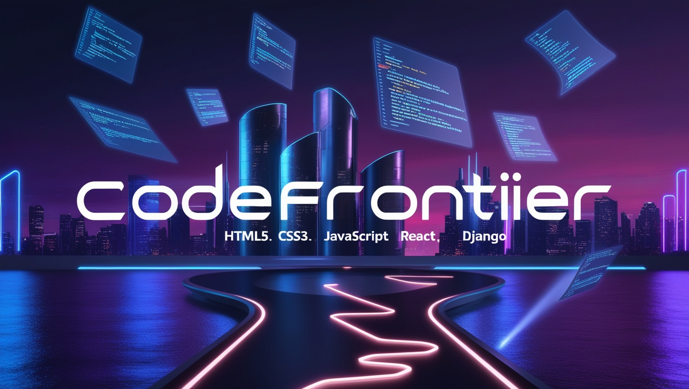

# CodeFrontier

🎉 Introducing: CodeFrontier – 31 Days of Modern Web Development! 



Are you ready to elevate your web development skills? Join me for a transformative journey as I launch CodeFrontier, a 31-day newsletter dedicated to exploring cutting-edge web development practices.

## 📅 What to Expect:

- 🚀 Day-by-Day Mastery: HTML fundamentals, CSS innovations, JavaScript essentials, React mastery, and Django expertise.
- 📖 Hands-On Tutorials: Practical examples, code walkthroughs, and real-world use cases.
- 🌟 Industry Insights: Best practices, pitfalls to avoid, and modern frameworks explained.

## Repository Structure

The repository is organized as follows:
- **Day 1**: Add Day 1 HTML5 structure ([commit](https://github.com/sajan69/CodeFrontier/commit/0abe5076f658290a33b2fe71dda5d7ea67c3743e))
- **Day 2**: HTML5 Forms and Input Elements ([commit](https://github.com/sajan69/CodeFrontier/commit/445e6e3ebec10b1457dbbd918178b2d444d23486))
- **Day 3**: Media Elements in HTML5 ([commit](https://github.com/sajan69/CodeFrontier/commit/64fe5333abbe341b1b774c010106881f192f0c87))
- **Day 4**: Semantic HTML5 Elements ([commit](https://github.com/sajan69/CodeFrontier/commit/528ce8f87ea4dffdded6c606f9b7acf0ac345d3e))
- **Day 5**: Advanced Features of HTML ([commit](https://github.com/sajan69/CodeFrontier/commit/f182305d78ace641d825f98dc2ff1917dc5f86d0))
- **Day 6**: CSS Fundamentals ([commit](https://github.com/sajan69/CodeFrontier/commit/48aa50fd9b2d10cd8c5695c2db99d5dc9aae6edc))
- **Day 7**: CSS Layout ([commit](https://github.com/sajan69/CodeFrontier/commit/c26a37c8df7a5708ba8dfc937441fec9e1fef9a1))
- **Day 8**: CSS Styling ([commit](https://github.com/sajan69/CodeFrontier/commit/68c15b0f229cd40ee87b0c5d5e0d8d4f29794d43))
- **Day 9**: CSS Responsive Design ([commit](https://github.com/sajan69/CodeFrontier/commit/c990fe96f55f1398f184f48b15ba240e3bfeb68f))


## Getting Started

To get a local copy up and running, follow these steps.

### Prerequisites
- Install Node.js
- Install npm
- Install Python
- Install Django
- Install Git
- Install VS Code


### Installation
1. Clone the repo:
   ```sh
   git clone https://github.com/sajan69/CodeFrontier.git
   ```
2. Navigate to the project directory:
   ```sh
   cd CodeFrontier
   ```

## Contact

Sajan Adhikari - [sajanac46@gmail.com]

LinkedIn Newsletter: [CodeFrontier](https://www.linkedin.com/newsletters/codefrontier-7280227817785544704/)

Project Link: [https://github.com/sajan69/CodeFrontier](https://github.com/sajan69/CodeFrontier)
